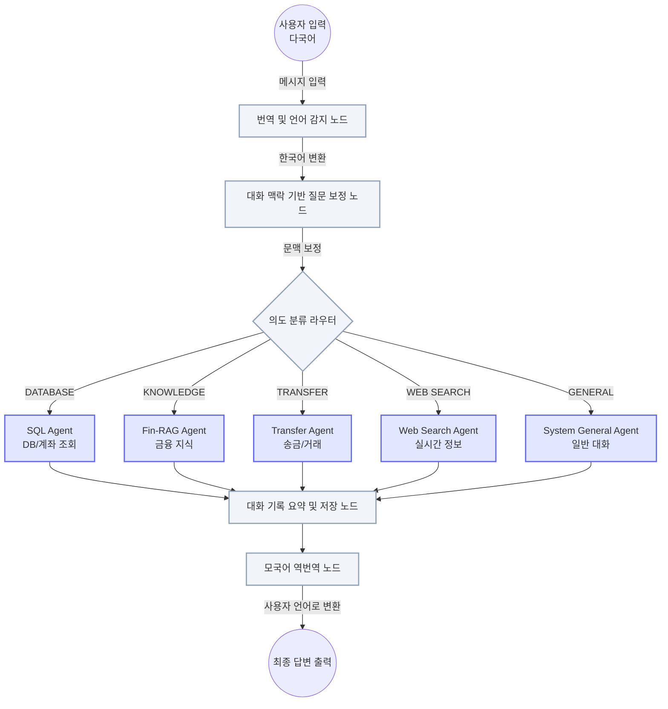

# 🐘 벗 (BeoTT)
**Bridge for easy overseas Translator & Transaction**

> **"한국에서의 복잡한 금융 업무, 당신의 든든한 친구 '벗(BeoTT)'이 도와줄게요!"** 
> 대한민국 거주 외국인을 위한 다국어 지원 AI 금융 에이전트 챗봇

 

## 📖 프로젝트 소개 (About the Project)
**벗(BeoTT)** 은 낯선 타국에서 언어 장벽과 어려운 금융 용어로 인해 불편을 겪는 외국인들을 위한 맞춤형 AI 금융 에이전트입니다. 
사용자가 모국어로 자연스럽게 질문하면, AI가 언어를 자동으로 감지 및 번역합니다. 이후 복잡한 금융 지식을 눈높이에 맞춰 설명(RAG)하거나, 최신 웹 정보를 검색(Web Search)하고, 실제 송금 및 조회 등의 금융 거래(Transaction)까지 대화형 인터페이스로 완벽하게 연결(Bridge)해 줍니다.

 

## ✨ 핵심 기능 (Key Features)

1. **🌐 실시간 다국어 번역 인터페이스 (Translation)**
   - 사용자의 입력 언어를 자동 감지하여 AI 에이전트 내부적으로는 한국어로 처리하고, 최종 답변은 다시 사용자의 모국어로 역번역하여 제공합니다. 금융 시스템의 언어 장벽을 완전히 허물어줍니다.

2. **📚 RAG 기반 맞춤형 금융 용어 해설 (Knowledge)**
   - "DSR이 뭐야?", "연말정산은 어떻게 해?" 등 어려운 한국의 금융/경제 용어를 ChromaDB 벡터 저장소를 활용하여 외국인의 눈높이에 맞춰 쉽고 정확하게 설명합니다.

3. **💸 대화형 송금 및 금융 거래 (Transaction)**
   - 복잡하고 딱딱한 UI 대신, 챗봇과 대화하듯 자연스럽게 송금 프로세스를 진행합니다. 진행 중인 송금 컨텍스트를 메모리에 안전하게 유지하며, 동적인 확인/취소 버튼을 통해 정확하고 안전한 거래를 지원합니다.

4. **📊 사용자 맞춤형 DB 조회 (Database)**
   - Text-to-SQL 에이전트를 통해 사용자의 계좌 내역, 잔액, 등록된 연락처 등을 안전하게 조회하고 맞춤형 답변을 생성합니다.

5. **🔍 실시간 웹 검색 (Web Search)**
   - Tavily API를 활용하여 내부 지식 베이스(DB)에 없는 최신 금융 뉴스, 실시간 환율, 주가 등의 정보를 실시간으로 검색하고 답변을 제공합니다.

 

## 🏗 시스템 아키텍처 (Architecture)

BeoTT은 **LangGraph**를 활용하여 복잡한 다단계 에이전트 워크플로우를 안정적이고 유연하게 구축했습니다.

 

## 🛠 기술 스택 (Tech Stack)

### Frontend
- **Streamlit**: 빠르고 직관적인 반응형 챗봇 UI 및 동적 컴포넌트(송금 승인/거절 버튼 등) 렌더링
- **HTML/CSS**: 사용자 경험(UX) 향상을 위한 커스텀 스타일링 적용

### AI & Backend
- **LangChain & LangGraph**: 복잡한 다단계 에이전트 파이프라인 및 상태(State) 기반 워크플로우 제어
- **OpenAI API (gpt-5-mini / gpt-4o-mini)**: 핵심 LLM 추론, 의도 분류 및 다국어 번역 엔진
- **Tavily API**: 실시간 최신 정보 획득을 위한 웹 검색 엔진
- **bcrypt**: 사용자 비밀번호 및 PIN 코드의 안전한 양방향 해싱 암호화 처리

### Database
- **MySQL**: 사용자 정보, 계좌 내역, 연락처 등 정형 데이터 구조화 및 관리
- **ChromaDB**: RAG 시스템을 위한 금융/경제 용어 벡터 임베딩 저장소 (앱 실행 시 자동 초기화 및 세팅 지원)

 

## 🚀 시작하기 (Getting Started)

### 1. 사전 요구 사항 (Prerequisites)
- Python 3.9 이상
- MySQL 서버 실행 중
- `OpenAI API Key` 및 `Tavily API Key` (환경 변수 `.env` 파일 설정 필요)

### 2. 설치 및 환경 설정 (Installation & Setup)

(Bash 설치 및 환경설정 코드 자리)

### 3. 프로젝트 실행 (Run)
처음 실행 시, 벡터 DB가 비어있다면 `utils/set_chromaDB.py` 스크립트가 자동으로 실행되어 초기 금융 용어 지식 베이스를 구축합니다.

 

## 🤝 팀 구성원 (Team)
- **이종혁** (데이터 및 AI 개발) - *에이전트 라우팅 설계, 프롬프트 엔지니어링, RAG 파이프라인 구축 및 통합*

---
*© 2025 BeoTT (우리FISA 6기). All rights reserved.*